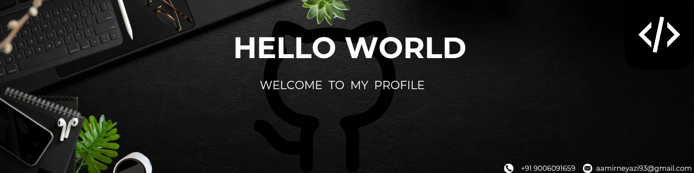

<h1 align="center">Hi 👋, I'm Aamir Neyazi</h1>
<h3 align="center">🚀 B.Tech CSE Student | 💻 Web Developer | 📊 Aspiring Data Scientist</h3>

  
  &nbsp;&nbsp;
  
  &nbsp;&nbsp;
  

---

### 🧑‍💻 About Me

<picture>
  <source media="(prefers-color-scheme: dark)" srcset="./Skills_Animation_Dark.gif">
  <source media="(prefers-color-scheme: light)" srcset="./Skills_Animation_White.gif">
  
</picture>

- 🎓 I'm currently pursuing **B.Tech in Computer Science** 
- 🛠️ Actively working on:  
  `Flask Blog System Website`, `Women Safety Platform - ProtecHer`
- 🌱 Learning:  
  `DSA`, `Backend Development`, `Data Science`, `API Integration`
- 💬 Ask me about:  
  `Python`, `C++`, `Java`, `Flask`, `Git`, `Project Deployment`
- 🤝 Looking to collaborate on:  
  **Open Source**, **Web Projects**, **Real-World Problem Solvers**
- 🎯 Goal: Become a **Data Scientist**
- ⚡ Fun fact: I enjoy building and breaking projects to learn faster!

---

### 🛠️ Languages & Tools

  
  
  
  
  
  
  
  
  
  

---

### 📊 GitHub Stats

  
  

---

### 📂 Featured Projects

- 🔒 [**ProtecHer - Women Safety Platform**] 
  A women’s safety platform using CCTV, real-time location, and tutorials.  
- 📝 **Flask Blog Website**  
  Personal blogging platform with login/register and dashboard features.

---

### 📫 🤝Connect With Me🤝

  

---

